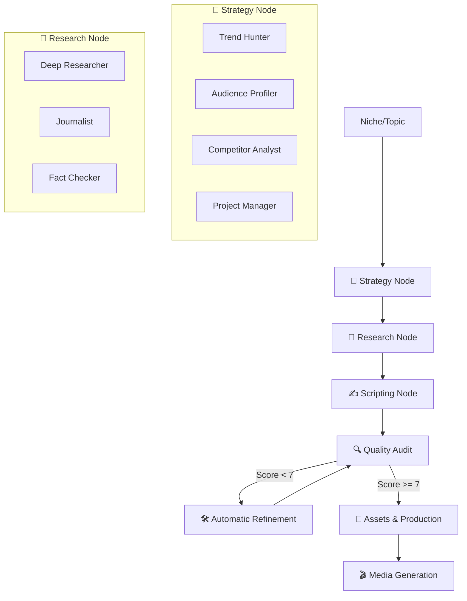

# 🧠 Neural Swarm v2.2: The Autonomous YouTube Factory (LangGraph Powered)

> **Neural Swarm v2.2** is a sovereign AI workforce that orchestrates **15 specialized Gemini agents** using a high-performance **LangGraph** State Machine. It transforms raw niches into viral-ready YouTube productions using real-time competitive intelligence.

[](https://www.python.org/)
[](https://aistudio.google.com/)
[](https://langchain-ai.github.io/langgraph/)

---

## 🏗️ v2.2 Architecture: The Neural Graph

Neural Swarm v2.2 replaces linear orchestration with a **StateGraph**. This enables complex conditional flows, parallel execution tracks, and an **Autonomous Feedback Loop**.



---

## 🕵️ Real-Time Intelligence & Grounding

### 🌍 Google Search Grounding
Neural Swarm no longer relies solely on static training data. Strategic agents utilize **Gemini Grounding with Google Search** to:
*   Retrieve up-to-the-minute market trends.
*   Verify factual claims against live technical databases.
*   Provide real-world citations and web sources for script validation.

### 📊 Competition Intelligence
The new **Competitor Analyst Agent** performs live scraping (via Grounding) to identify:
*   Top-performing competitor videos in your niche.
*   Winning thumbnail patterns and titles.
*   Real engagement metrics and video URLs for direct reference in the UI.

---

## 🤖 The Swarm: Specialized Intelligence

### 🏗️ Department 1: Strategy (Real-Time)
*   **📡 Trend Hunter**: Scans for exploding topics using Google Trends API.
*   **🕵️ Competitor Analyst**: Maps the competitive landscape with real links.
*   **👥 Audience Profiler**: Engineers the "Ideal Persona" based on current niche data.

### 🔎 Department 2: Intelligence & Verification
*   **🧠 Deep Researcher**: Digs into technical and historical databases with **Search Grounding**.
*   **✅ Fact Checker**: Rigorous agent that cross-references all scripts against grounded research.

### ✍️ Department 3: Narrative & Refinement
*   **📝 Lead Writer**: Writes in the signature "Fenrir" epic style.
*   **🎭 Editor en Jefe**: Automatically refines scripts if the Quality Audit finds issues.

---

## 🚀 Extreme Production Features

*   **🎙️ Voice Studio**: Native Gemini TTS with 30+ tones and emotional control.
*   **🖼️ Nano Banana Pro**: High-fidelity visual creation using `gemini-3-pro-image-preview`.
*   **⚙️ Live Prompt Editor**: Modify agent instructions directly in the browser.
*   **🌐 Full Internationalization**: Support for multiple languages with a single click.

---

## 🛠️ Quick Start

1.  **Clone & Install**:
    ```bash
    git clone https://github.com/monrroyag/Neural-Swarm-2.0-YouTube-Gemini.git
    cd Neural-Swarm-2.0-YouTube-Gemini
    pip install -r requirements.txt
    ```

2.  **Configuration**:
    *   Start the server: `python run.py`.
    *   Navigate to the **Settings** tab.
    *   Enter your `GEMINI_API_KEY` ([Get it here](https://aistudio.google.com/)).

3.  **Execute Swarm**:
    Enter your niche in the Dashboard and click **IGNITE**.

---

## 🛡️ Security & Privacy
Neural Swarm **never** stores your API key in the source code. All configuration remains local in `settings.json`, which is excluded from version control.

---

## 🤝 The Creator
Developed by **Agustín Arellano**. 
Connect on [GitHub](https://github.com/monrroyag).

---
**Neural Swarm v2.2** | *The Autonomous Future of Content Creation.*
