# 🧠 Neural Swarm v2.0: The Autonomous YouTube Factory

> **Neural Swarm v2.0** is not just a script; it's a sovereign AI workforce. It orchestrates **15 specialized Gemini-powered agents** across a multi-stage intelligence pipeline to transform a single niche into a viral-ready YouTube production.

[](https://www.python.org/)
[](https://aistudio.google.com/)
[](https://opensource.org/licenses/MIT)

---

## 🏗️ System Architecture: The 4-Phase Intelligence Pipeline

Neural Swarm utilizes a **Synchronous Multi-Agent Orchestration** model. Instead of a single LLM call, your content passes through four rigorous departments.

```mermaid
graph TD
    A[Niche/Topic] --> B[🏢 Dept 1: Strategy]
    B --> C[🔎 Dept 2: Research]
    C --> D[✍️ Dept 3: Narrative]
    D --> E[🎨 Dept 4: Production]
    E --> F[🎥 Final Assets]

    subgraph "🏢 Phase 1: Strategy"
    B1[Trend Hunter]
    B2[Audience Profiler]
    B3[Project Manager]
    end

    subgraph "🔎 Phase 2: Intelligence"
    C1[Deep Researcher]
    C2[Investigative Journalist]
    C3[Fact Checker]
    end

    subgraph "✍️ Phase 3: Scripting"
    D1[Script Architect]
    D2[Lead Writer]
    D3[Hook Master]
    D4[Comedy Specialist]
    end

    subgraph "🎨 Phase 4: Creative"
    E1[Art Director]
    E2[Prompt Engineer]
    E3[Audio Director]
    E4[SEO Optimizer]
    end
```



---

## 🤖 The Swarm: 15 Highly Specialized Agents

### 🏢 Department 1: Strategy & Growth
*   **📡 Trend Hunter**: Scans market data to identify high-velocity viral potential.
*   **👥 Audience Profiler**: Engineers the "Ideal Viewer Persona" to tailor tone and psychological hooks.
*   **📋 Project Manager**: The "Brain" of the phase. It synthesizes all strategy into a **Project Bible**.

### 🔎 Department 2: Intelligence & Verification
*   **🧠 Deep Researcher**: Digs into technical, historical, and scientific databases.
*   **📰 Investigative Journalist**: Crafts the "Human Angle" and finds compelling, non-obvious stories.
*   **✅ Fact Checker**: A rigorous terminal agent that verifies every claim against the research data.

### ✍️ Department 3: Creative Narrative
*   **🏗️ Script Architect**: Designs the structural arc—ensuring optimal retention through pacing.
*   **📝 Lead Writer**: Conversational engine. Writes the main dialogue in your target language.
*   **🪝 Hook Master**: Hyper-focused on the first 15 seconds to minimize drop-off.
*   **🎭 Comedy Specialist**: Adds wit, "easter eggs," and personality to the script.

### 🎨 Department 4: Visual & Audio Production
*   **🎭 Art Director**: Defines the "Visual DNA" (Lighting, Style, Palette).
*   **🖼️ Prompt Engineer**: Converts visual concepts into technical prompts for **Nano Banana Pro**.
*   **🎤 Audio Director**: Orchestrates the **Voice Studio** using native Gemini TTS.
*   **🏷️ SEO Optimizer**: Generates high-CTR titles, metadata, and viral tags.

---

## 🚀 Extreme Performance Features

### 💎 Gemini 3.0 & 2.5 Ecosystem
Neural Swarm is built for the latest frontier models.
*   **Gemini 3 Pro**: Used for complex reasoning and "Thinking" deep research.
*   **Gemini 3 Flash**: Powers the high-speed scripting and strategy agents.
*   **Gemini 2.5 Flash Image (Nano Banana)**: Ultra-fast visual generation.
*   **Gemini 3 Pro Image (Nano Banana Pro)**: Professional-grade text-to-image with advanced reasoning.

### 🎙️ Voice Studio (Native TTS)
Forget robotic voices. Access **30+ Native Gemini Tones** like *Fenrir*, *Puck*, and *Zephyr*. Control style, pace, and emotion through natural language notes.

### 🌎 Internationalization by Design
Every agent prompt and UI label is dynamic. Edit prompts live in the browser to change the "Personality" of your swarm instantly.

---

## 🛠️ Deployment Guide

### 1. Prerequisites
*   Python 3.11+
*   Google Gemini API Key ([Get it here](https://aistudio.google.com/))

### 2. Installation
```bash
# Clone the repository
git clone https://github.com/monrroyag/Neural-Swarm-2.0-YouTube-Gemini.git

# Enter the project
cd Neural-Swarm-2.0-YouTube-Gemini

# Install the dependencies
pip install -r requirements.txt
```

### 3. Execution
```bash
python run.py
```
Open your browser at `http://localhost:8000`.

---

## 🛡️ Security & Privacy
> [!IMPORTANT]
> **API Key Safety**: Neural Swarm **never** stores your API key in the source code or version control. All configuration is kept locally in `settings.json` (auto-ignored by Git). Your credentials stay on your machine.

---

## 🤝 The Creator
Developed by **Agustín Arellano**. 
Explore more work on [GitHub](https://github.com/monrroyag).

---
**Neural Swarm v2.0** | *The Autonomous Future of Content Creation.*
