# 🧠 Neural Swarm v2.2.6: The Ultimate Autonomous YouTube Factory

> **The Sovereign AI Workforce.** Neural Swarm v2.2.6 is an industrial-grade, multi-agent orchestration framework designed to automate the entire lifecycle of YouTube content production. Built on **LangGraph** and powered by the **Google Gemini 3.0 & 2.5** ecosystem, it deploys **15 specialized agents** to transform a single niche into a viral-ready video production.


---

## 🏗️ Architectural Core: The Neural Graph (Powered by LangGraph)

Neural Swarm v2.2 leverages a **Stateful Graph Architecture**. Unlike traditional sequential scripts, the Swarm operates as a dynamic state machine where data flows between specialized nodes, allowing for parallel execution, conditional logic, and autonomous quality control.

### 🔄 The Autonomous Feedback Loop
The most powerful feature of v2.2 is its **Self-Correcting Intelligence**. The orchestrator includes a **Quality Gate** node that routes the workflow based on performance metrics.
*   **Audit Check**: When a script is generated, it's sent to the `AuditPanel`.
*   **The Threshold**: If the global quality score is below **7/10**, the graph rejects the content.
*   **Iterative Refinement**: The `Editor en Jefe` receives the full audit critique and the original script, re-writing it to address specific flaws. The process repeats until the quality threshold is met.

### 🛑 Emergency Stop & Control (v2.2.6)
Total control over the Swarm. The new **Stop Swarm** functionality allows you to halt the entire production pipeline at the next checkpoint. This is critical for:
*   **Saving API Quota**: Stop the generation if the niche or strategy isn't meeting expectations early on.
*   **Real-Time Status**: A persistent "ACTIVE" indicator keeps you informed of the Swarm's heartbeat.

```mermaid
graph TD
    A[🎯 Niche/Topic] --> B[🏢 Strategy Node]
    B --> C[🔎 Intelligence Node]
    C --> D[✍️ Creative Node]
    D --> E[🔍 Quality Audit]
    E -- "Reject (<7/10)" --> F[🛠️ Auto-Refinement]
    F --> E
    E -- "Approve (>=7/10)" --> G[🎨 Creative Assets]
    G --> H[🎬 Media Studio]
    H --> I[🎥 Final Video Dossier]

    subgraph "🏢 Phase 1: Strategy"
    B1[Trend Hunter]
    B2[Audience Profiler]
    B3[Competitor Analyst]
    B4[Project Manager]
    end

    subgraph "🔎 Phase 2: Intelligence"
    C1[Deep Researcher]
    C2[Journalist]
    C3[Fact Checker]
    end
    
    subgraph "✍️ Phase 3: Scripting"
    D1[Script Architect]
    D2[Lead Writer]
    D3[Hook Master]
    D4[Comedy Expert]
    end
```



---

## 🤖 The Swarm: 15 Highly Specialized Agents

Every agent in the swarm is a specialized persona with its own prompt engineering, temperature settings, and tool access.

### 🏢 Department 1: Strategy & Growth (The Brain)
1.  **📡 Trend Hunter**: Uses real-time **Google Search Grounding** to identify high-velocity viral potential. It looks for "content gaps"—topics people are searching for but no one is answering well.
2.  **🕵️ Competitor Analyst**: Scrapes top performing videos in the niche. Extracts titles, views, and **Winning Strategies**. It provides real URLs to the swarm so the final content is positioned to win against the competition.
3.  **👥 Audience Profiler**: Engineers a psychological deep-dive. It identifies the "Ideal Viewer Persona," their primary fears, deep desires, and why they should care about your video.
4.  **📋 Project Manager**: The "Director." It synthesizes all strategy into the **Project Bible**, ensuring every subsequent agent stays on-target and on-brand.

### 🔎 Department 2: Intelligence & Verification (The Truth)
5.  **🔬 Deep Researcher**: Performs technical, historical, and statistical deep-dives. It produces massive dossiers of factual information verified via **Google Search Grounding**.
6.  **📰 Investigative Journalist**: Finds the "Human Angle." It looks for compelling stories, anecdotes, and "hidden truths" that add emotional depth to the technical research.
7.  **✅ Fact Checker**: The terminal filter. It cross-references the journalism and research to eliminate "hallucinations" and ensure maximum factual integrity.

### ✍️ Department 3: Creative Narrative (The Voice)
8.  **🏗️ Script Architect**: Designs the structural blueprint of the video. It ensures the script follows retention-optimized structures (Hook, Curiosity Gaps, Mid-roll engagement, CTA).
9.  **📝 Lead Writer**: The main creative engine. Crafts the dialogue in the signature **Fenrir** style—epic, authoritative, and deeply engaging.
10. **🪝 Hook Master**: Hyper-optimizes the first 15 seconds. It uses psychological triggers to minimize viewer drop-off.
11. **🎭 Comedy Specialist**: Adds wit, "ester eggs," and personality. It ensures the script isn't just informative, but entertaining.

### 🎨 Department 4: Production & SEO (The Factory)
12. **🎭 Art Director**: Establishes the "Visual DNA"—lighting, style, palette, and composition rules for the entire project.
13. **🖼️ Prompt Engineer**: Converts visual concepts into technical prompts for the **Nano Banana** image engines.
14. **🎤 Audio Director**: Configures the **Voice Studio** with native Gemini TTS instructions.
15. **🏷️ SEO Optimizer**: Generates high-CTR metadata, including titles designed for the algorithm and search-optimized descriptions.

---

## 🎨 The Media Studios: Native AI Integration

### 🍌 Nano Banana Art Studio
Neural Swarm integrates elite image models directly into the production flow.
*   **Nano Banana (`gemini-2.5-flash-image`)**: Optimized for ultra-fast generation of high-quality background b-roll.
*   **Nano Banana Pro (`gemini-3-pro-image-preview`)**: Cinematic-grade art for thumbnails and core visual segments. It understands complex spatial reasoning and text-in-image instructions.

### 🎙️ Voice Studio (Native Gemini TTS)
Neural Swarm completely bypasses robotic sounding third-party TTS. 
*   **30+ Native Gemini Voices**: Access high-fidelity tones like *Fenrir*, *Puck*, *Zephyr*, *Luna*, and *Fenrir*.
*   **Dynamic Expression**: Control style, pace, and emotion through natural language notes processed by the Audio Director agent.

---

## 🌍 Real-Time Intelligence: Google Search Grounding

Neural Swarm v2.2 is connected directly to the internet. Strategic agents utilize **Gemini Grounding with Google Search** to:
*   **Live Market Data**: Identify topics trending *right now*.
*   **Fact Verification**: Cross-reference claims against updated technical databases and news.
*   **Citations**: Generate responses with verifiable web sources and URLs.
*   **Competitive Intelligence**: Analyze actual YouTube competitors with real performance stats and video links.

---

## 📊 Technical Stack

*   **Runtime**: Python 3.11+
*   **Orchestration**: LangGraph (Stateful Multi-Agent Framework)
*   **Engine**: Google Gemini API (3.0 Pro/Flash, 2.5 Pro/Flash)
*   **Backend**: FastAPI (Async high-performance server)
*   **Frontend**: AlpineJS & Vanilla CSS (Dynamic Glassmorphic UI)
*   **Database**: JSON-based persistent project storage.

---

## 🛠️ Deployment & Ignition

### 1. Prerequisites
*   Python 3.11 or higher.
*   Google Gemini API Key ([Obtain here](https://aistudio.google.com/)).

### 2. Installation
```bash
# Clone the repository
git clone https://github.com/monrroyag/Neural-Swarm-2.0-YouTube-Gemini.git

# Enter the directory
cd Neural-Swarm-2.0-YouTube-Gemini

# Install dependencies
pip install -r requirements.txt
```

### 3. Execution
```bash
python run.py
```
Open your browser at `http://localhost:8000`.

---

## 🛡️ Security & Privacy
> [!IMPORTANT]
> **Credential Safety**: Neural Swarm follows industrial security standards. Your API keys are **never** stored in the code or synced to GitHub. All configuration is managed locally via `settings.json` (auto-ignored).

---

## 🤝 About the Project
Created by **Agustín Arellano**. Designed to empower creators with the most advanced autonomous AI workforce in the industry.

*   **GitHub**: [monrroyag](https://github.com/monrroyag)
*   **Neural Swarm v2.2** - *The Autonomous Future of YouTube.*

---
