# 🧠 Neural Swarm v2.2: The Autonomous YouTube Production Factory

> **The Sovereign AI Workforce.** Neural Swarm v2.2 is an advanced, multi-agent orchestration framework designed to automate the entire lifecycle of YouTube content creation. Built on **LangGraph** and powered by the **Google Gemini 3.0 & 2.5** ecosystem, it deploys **15 specialized agents** to transform a single niche into a viral video production.


---

## 🏗️ Architectural Core: The Neural Graph

Neural Swarm v2.2 leverages a **Stateful Graph Architecture** (powered by **LangGraph**). Unlike sequential scripts, the Swarm operates as a dynamic state machine with autonomous decision-making and feedback loops.

### 🔄 The Feedback Loop (Self-Correcting Intelligence)
The orchestrator includes a **Quality Gate**. If the `AuditPanel` detects a score below **7/10**, the graph automatically triggers a **Refinement Loop**:
1.  **Auditor** identifies flaws (pacing, hooks, SEO).
2.  **Editor en Jefe** receives the critique and original script.
3.  **Refinement Node** re-writes the content iteratively until it passes the quality threshold.

```mermaid
graph TD
    A[🎯 Niche/Topic] --> B[🏢 Strategy Node]
    B --> C[🔎 Intelligence Node]
    C --> D[✍️ Creative Node]
    D --> E[🔍 Quality Audit]
    E -- "Reject (<7)" --> F[🛠️ Auto-Refinement]
    F --> E
    E -- "Approve (>=7)" --> G[🎨 Creative Assets]
    G --> H[🎬 Media Studio]
    H --> I[🎥 Final Video Dossier]

    subgraph "🏢 Phase 1: Strategy"
    B1[Trend Hunter]
    B2[Audience Profiler]
    B3[Competitor Analyst]
    B4[Project Manager]
    end

    subgraph "🔎 Phase 2: Intelligence"
    C1[Deep Researcher]
    C2[Journalist]
    C3[Fact Checker]
    end
```



---

## 🤖 The Swarm: 15 Specialized Agents

Each agent is a finely-tuned "persona" with dedicated prompts and access to specific tools like **Google Search Grounding**.

### 🏢 Department 1: Strategy & Growth
*   **📡 Trend Hunter**: Uses real-time grounding to scan Google Trends and identify high-velocity topics.
*   **🕵️ Competitor Analyst**: Scrapes top performing videos in the niche. Extracts titles, views, and **Winning Strategies** to ensure your video outperforms the market.
*   **👥 Audience Profiler**: Engineers a psychological deep-dive into viewer fears, desires, and triggers.
*   **📋 Project Manager**: Synthesizes all strategy into the **Project Bible**, the master guide for the rest of the swarm.

### 🔎 Department 2: Intelligence & Verification
*   **🔬 Deep Researcher**: Performs technical, historical, and statistical research using **Search Grounding**.
*   **📰 Investigative Journalist**: Finds the "Human Angle"—the storytelling juice that makes videos go viral.
*   **✅ Fact Checker**: Rigorously verifies every claim in the script against the grounded research dossier.

### ✍️ Department 3: Creative Narrative
*   **🏗️ Script Architect**: Designs the structural blueprint (Hook, Retention Loop, Re-engagement, CTA).
*   **📝 Lead Writer**: The creative engine. Crafts the dialogue in your target language using the **Fenrir** epic style.
*   **🪝 Hook Master**: Hyper-optimizes the first 15 seconds to minimize drop-off.
*   **🎭 Comedy Specialist**: Infuses wit and personality to maximize viewer retention.

### 🎨 Department 4: Visual & Post-Production
*   **🎭 Art Director**: Establishes the visual style manual (lighting, palette, composition).
*   **🖼️ Prompt Engineer**: Generates technical prompts for the **Nano Banana** image engines.
*   **🎤 Audio Director**: Configures the **Voice Studio** with native Gemini TTS.
*   **🏷️ SEO Optimizer**: Generates high-CTR metadata, viral titles, and optimized descriptions.

---

## 🎨 The Studios: Native Generation

### 🍌 Nano Banana Art Studio
Neural Swarm integrates the latest image models directly within the flow:
*   **Nano Banana (`gemini-2.5-flash-image`)**: Ultra-fast, high-quality visual generation.
*   **Nano Banana Pro (`gemini-3-pro-image-preview`)**: High-fidelity, cinematic art with complex prompt adherence.

### 🎙️ Voice Studio (Native Gemini TTS)
Neural Swarm replaces traditional robotic voices with native **Gemini Text-to-Speech**:
*   **30+ Professional Voices**: Use legendary tones like *Fenrir*, *Puck*, *Zephyr*, or *Luna*.
*   **Emotional Control**: Direct control over pacing, emphasis, and dramatic pauses via the **Audio Instructions** agent.

---

## 🚀 Key Features

*   **🌍 Real-Time Grounding**: All strategy and research is grounded in **Google Search**, providing citations and live web data.
*   **⚙️ Live Agent Editor**: Modify every agent's instruction on-the-fly via the Settings UI.
*   **🌐 Global I18n**: Support for Spanish, English, and beyond with one-click localization.
*   **💎 LangGraph Orchestration**: Complex state management for production-grade stability.

---

## 🛠️ Deployment

1.  **Clone the Factory**:
    ```bash
    git clone https://github.com/monrroyag/Neural-Swarm-2.0-YouTube-Gemini.git
    cd Neural-Swarm-2.0-YouTube-Gemini
    ```

2.  **Install Requirements**:
    ```bash
    pip install -r requirements.txt
    ```

3.  **Ignite the Swarm**:
    ```bash
    python run.py
    ```
    Access the Dashboard at `http://localhost:8000`.

---

## 🤝 Contribution & Support
Built for the next generation of content creators by **Agustín Arellano**.

*   **GitHub**: [monrroyag](https://github.com/monrroyag)
*   **Neural Swarm v2.2** - *The future of autonomous production is here.*

---
> [!IMPORTANT]
> **API Security**: No API keys are stored in this repository. Use the built-in UI Settings to securely input your credentials, which are saved locally in `settings.json`.
